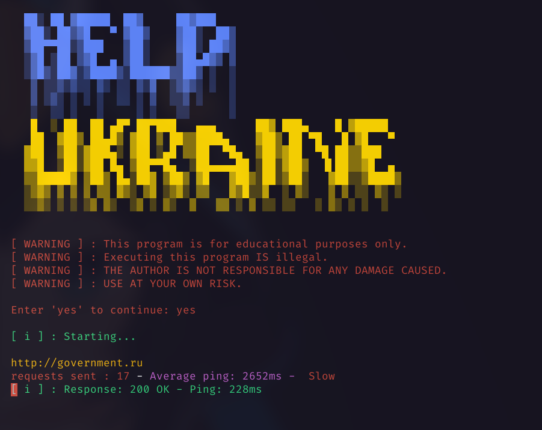
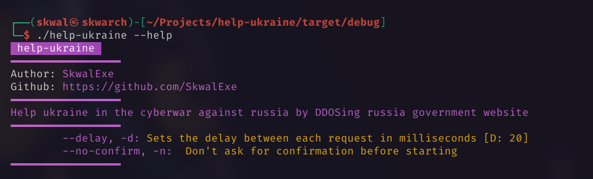
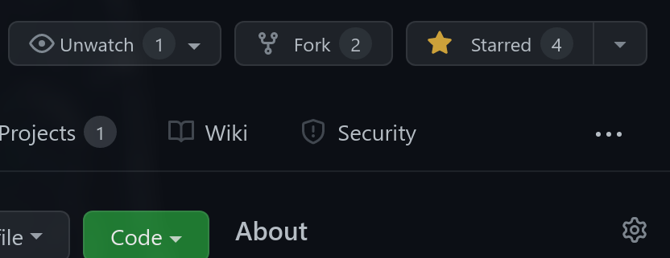

<a href="https://github.com/SkwalExe#ukraine"></a>

# Help Ukraine 🇺🇦

for several weeks, putin's war against russia has been killing thousands of people, you would like to help them but you tell yourself that on your scale as a simple citizen you can do nothing, each contribution, no matter how small, is useful, that's why I created the help-ukraine project.

This is a simple program that you can run in the background on your computer, which will DDOS the Russian government site, the site's average response time is already over 3382ms, which is very slow. If a sufficient number of people launch the program simultaneously, the site may no longer work, which would already be a step forward in deterring Putin from continuing the war.



Help ukraine 🇺🇦 in the cyberwar against russia
by DDOSing russia government website

# Warning ⛔

**Executing this program IS illegal.**

THE AUTHOR IS NOT RESPONSIBLE FOR ANY DAMAGE CAUSED BY THIS PROGRAM.

USE AT YOUR OWN RISK.

# Installation 📦

## With make - Linux 🐧

Run make

```bash
# 📂 help-ukraine/
make
```

## Build from source - Linux 🐧 & Windows 🪟

**Clone this repo**

```bash
git clone https://github.com/SkwalExe/help-ukraine.git
```

build with [cargo](https://doc.rust-lang.org/cargo/getting-started/installation.html)

```bash
# 📂 help-ukraine/
cargo build --release
```

**[ LINUX ONLY ] :** Move the binary

```bash
# 📂 help-ukraine/
sudo cp target/release/help-ukraine /usr/bin/help-ukraine
```

**On windows** the executable will be `target\release\help-ukraine.exe` you can move it wherever you want.

# Usage 📝



## Example 

```bash
help-ukraine -d 200 
```

# Docker 🐳

## Run the latest version

```bash
docker run --rm -it ghcr.io/skwalexe/help-ukraine:main
```

## Test your changes 🚧

### Build 🛠️

```bash
# 📂 help-ukraine/
docker build -t help-ukraine .
```

### Run 🏃

```bash
docker run --rm -it help-ukraine [OPTIONS]
```

# Uninstall 🗑

## With make

Run make uninstall

```bash
# 📂 help-ukraine/
make uninstall
```

## Or

Just remove the binary

```bash
sudo rm /usr/bin/help-ukraine
```

# Setting up development environment

For this project, I recommend Visual Studio Code.

You'll need to install the rust extension

```
ext install rust-lang.rust
```

# contributing

Start by **forking** this repository.



Then clone your fork to your local machine.

```git
git clone https://github.com/your-username/help-ukraine.git
```

Create a new branch

```git
git checkout -b super-cool-feature
```

Then [edit the source code](#setting-up-development-environment) in the `📂/src/` folder.

Once you're done, commit your changes and push them to the remote repository.

```git
git add --all
git commit -m "Add super-cool-feature"
git push origin super-cool-feature
```

Then, open a pull request on GitHub from your fork.

# final

If you have any problem, don't hesitate to open an issue

<a href="https://github.com/SkwalExe#ukraine"></a>